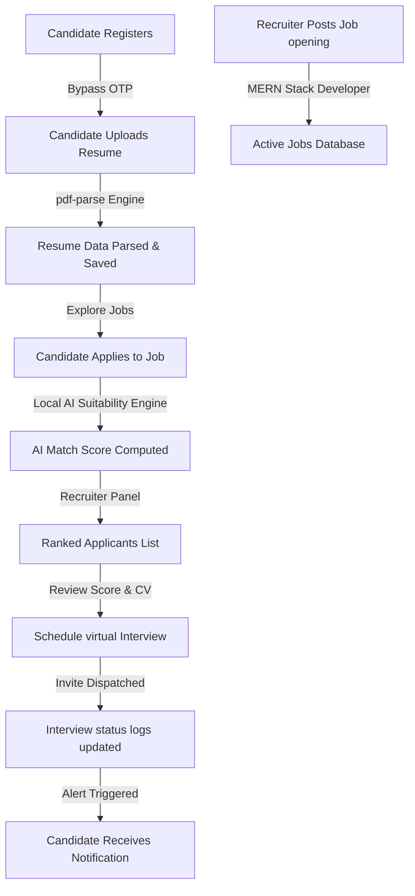

# Smart Recruitment Portal - Project Flow Story

This document maps the end-to-end user lifecycle of the Smart Recruitment Portal as a sequential story, showing the step-by-step path from candidate registration to recruiter decision-making.

---

---

## 📖 Chapter 1: The Candidate Onboards

1. **Candidate Opens Website**:
   - The candidate lands on the homepage (`/`) and navigates to the registration page (`/register`).
2. **Registration Submission**:
   - The candidate fills out the signup form and selects the **Candidate** role.
   - **Backend API**: `POST /api/auth/register`
   - **MongoDB Action**: Creates an entry in the `users` collection with `isVerified: false`. Also creates an empty profile in the `candidates` collection.
3. **Email OTP Verification**:
   - The candidate enters the 6-digit OTP code (`123456`).
   - **Backend API**: `POST /api/auth/verify-otp`
   - **MongoDB Action**: Updates the `User` document setting `isVerified: true` and clears the OTP field.
   - **Result**: The candidate is redirected to the Candidate Dashboard (`/candidate`).

---

## 📖 Chapter 2: The Resume is Parsed

1. **Accessing Profile**:
   - The candidate clicks **My Profile** to configure their technical skills and resume.
2. **Resume PDF Upload**:
   - The candidate uploads a text-based PDF resume.
   - **Backend API**: `POST /api/profile/resume`
   - **Processing**: The backend uses `pdf-parse` to convert the binary PDF into raw text. The parser runs regular expressions and matches words against a database-seeded list of technical skills.
   - **MongoDB Action**: Updates the `candidates` collection. The extracted skills, years of experience, and degrees are saved in the database, and the profile completion percentage is recalculated.

---

## 📖 Chapter 3: The Recruiter Posts a Job

1. **Recruiter Onboarding**:
   - A recruiter registers and configures their company details (e.g. `Innovative Tech Ltd`).
2. **Post Job Opening**:
   - The recruiter navigates to **Post a Job** and fills out the job requirements:
     - Title: `MERN Stack Developer`
     - Required Skills: `React.js, Node.js, MongoDB, JavaScript`
     - Min Experience: `2 Years`
     - Required Education: `Bachelor of Science`
   - **Backend API**: `POST /api/jobs`
   - **MongoDB Action**: Saves the new job entry in the `jobs` collection.

---

## 📖 Chapter 4: Job Application & AI Matching

1. **Exploring Positions**:
   - The candidate logs in, navigates to **Explore Jobs**, and searches for openings.
   - **Backend API**: `GET /api/jobs`
2. **Submitting Application**:
   - The candidate views the `MERN Stack Developer` posting and clicks **Apply for Position**.
   - **Backend API**: `POST /api/applications/apply`
   - **AI Evaluation**: The server evaluates the candidate's parsed profile against the job requirements, calculating a score across five domains:
     - **Skills Match**: 35%
     - **Experience Match**: 25%
     - **Education Match**: 20%
     - **Keyword Density**: 10%
     - **Projects & Certifications**: 10%
   - **MongoDB Action**: Creates an entry in the `applications` collection storing the calculated overall score (e.g. 85%) and the recommendation label (e.g. `Excellent`). Creates a notification in the `notifications` collection to alert the recruiter.

---

## 📖 Chapter 5: Evaluation & Interview Scheduling

1. **Recruiter Review**:
   - The recruiter opens the **Manage Jobs** dashboard, selects the job opening, and views the applicants.
   - **Backend API**: `GET /api/applications/job/:jobId`
   - **Result**: The applicants are sorted automatically by their AI match score, highlighting the best candidates.
2. **Schedule Interview**:
   - The recruiter decides to interview the candidate. They click **Schedule Interview**, choose a date, enter a time slot, and provide a meeting link.
   - **Backend API**: `POST /api/interviews`
   - **MongoDB Action**: 
     - Creates an entry in the `interviews` collection.
     - Updates the application status in the `applications` collection to `interviewing`.
     - Creates a notification entry to alert the candidate.
3. **Notification Delivered**:
   - The candidate logs in and receives an alert showing the scheduled interview details. They click the link to join the meeting.
